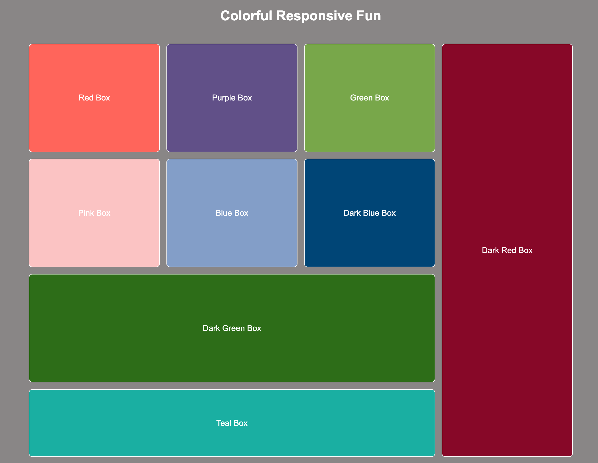

# WDE05 Colorful Responsive Fun with Media Queries

### Colorful Responsive Fun


## Description
In this assignment, you will build colorful boxes using `html` and `css` and use three different `@media` queries along with `CSS Grid` to create a responsive layout. These queries will adjust the layout and appearance of the boxes based on different screen sizes, helping you understand how to create flexible and adaptable designs.

Follow the steps in the provided HTML and CSS below to complete the assignment.

## Project Structure
```
ColorfulResponsiveBoxes/
│
├── index.html
└── styles.css
```

## Setup Steps
1. Create a folder named `ColorfulResponsiveBoxes`.
2. Inside this folder, create a blank `index.html` file.
3. In the same folder, create a blank `styles.css` file.

You are now ready to begin coding your colorful responsive boxes!

### Step 1: Build the HTML Structure
1. **Open `index.html`** and start by adding the basic HTML boilerplate. This includes the `DOCTYPE`, `html`, `head`, and `body` tags.
2. **Add a title** in the `<head>` section and link the `styles.css` file using the `<link>` tag.

```html
<!DOCTYPE html>
<html lang="en">

<head>
  <meta charset="UTF-8">
  <meta name="viewport" content="width=device-width, initial-scale=1.0">
  <title>Colorful Responsive Fun</title>
  <link rel="stylesheet" href="styles.css">
</head>
<body>
  <h1 class="title">Colorful Responsive Fun</h1>
  <!-- Add your boxes here -->
</body>
</html>
```

3. **Create a header** inside the `<body>` tag with an `<h1>` element. Give it a class of `title` and set the content to "Colorful Responsive Fun".

```html
<body>
  <h1 class="title">Colorful Responsive Fun</h1>
```

4. **Set up the container** for the boxes by creating a `<div>` with the class `container`. Inside this container, create nine `<div>` elements, each representing a box. Assign appropriate classes and labels to each box as shown below:

```html
  <div class="container">
    <div class="box box1" aria-label="Red Box">
      <p>Red Box</p>
    </div>
    <div class="box box2" aria-label="Purple Box">
      <p>Purple Box</p>
    </div>
    <div class="box box3" aria-label="Green Box">
      <p>Green Box</p>
    </div>
    <div class="box box4" aria-label="Pink Box">
      <p>Pink Box</p>
    </div>
    <div class="box box5" aria-label="Blue Box">
      <p>Blue Box</p>
    </div>
    <div class="box box6" aria-label="Dark Blue Box">
      <p>Dark Blue Box</p>
    </div>
    <div class="box box7" aria-label="Dark Green Box">
      <p>Dark Green Box</p>
    </div>
    <div class="box large-vertical box8" aria-label="Dark Red Box">
      <p>Dark Red Box</p>
    </div>
    <div class="box large-horizontal box9" aria-label="Teal Box">
      <p>Teal Box</p>
    </div>
  </div>
</body>
```

5. **Close the HTML tags** to complete the `index.html` structure.

```html
</html>
```
