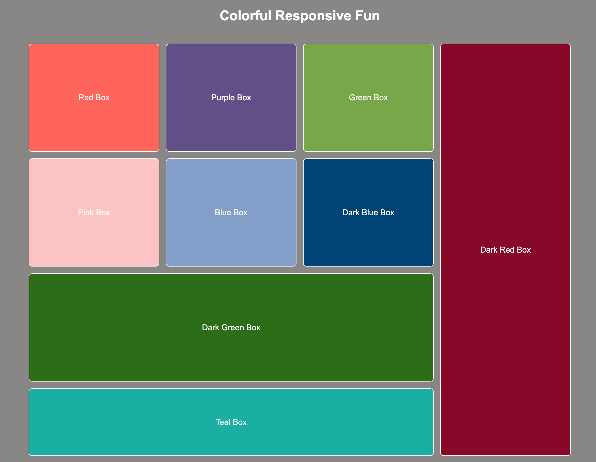
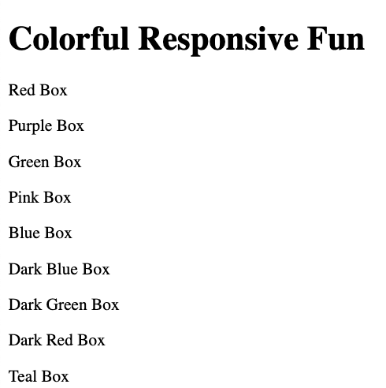

# WDE05 Colorful Responsive Fun with Media Queries

### Colorful Responsive Fun


## Description
In this assignment, you will build colorful boxes using `html` and `css` and use three different `@media` queries along with `CSS Grid` to create a responsive layout. These queries will adjust the layout and appearance of the boxes based on different screen sizes, helping you understand how to create flexible and adaptable designs.

Follow the steps in the provided HTML and CSS below to complete the assignment.

## Project Structure
```
ColorfulResponsiveBoxes/
│
├── index.html
└── styles.css
```

## Setup Steps
1. Create a folder named `ColorfulResponsiveBoxes`.
2. Inside this folder, create a blank `index.html` file.
3. In the same folder, create a blank `styles.css` file.

You are now ready to begin coding your colorful responsive boxes!

## Build the HTML Structure
1. **Open `index.html`** and start by adding the basic HTML boilerplate. This includes the `DOCTYPE`, `html`, `head`, and `body` tags.
2. **Add a title** in the `<head>` section and link the `styles.css` file using the `<link>` tag.

```html
<!DOCTYPE html>
<html lang="en">

<head>
  <meta charset="UTF-8">
  <meta name="viewport" content="width=device-width, initial-scale=1.0">
  <title>Colorful Responsive Fun</title>
  <link rel="stylesheet" href="styles.css">
</head>
<body>
  <!-- Add your boxes here -->
</body>
</html>
```

3. **Create a header** inside the `<body>` tags with an `<h1>` element. Give it a class of `title` and set the content to "Colorful Responsive Fun".

```html
<body>
  <h1 class="title">Colorful Responsive Fun</h1>
   <!-- Add your boxes here -->
</body>
```

4. **Set up the container** for the boxes by creating a `<div>` with the class `container`, place this code inside the `<body>` tags after the `<h1>` headler tag. Inside this container, create nine more `<div>` elements, each representing a box. Assign appropriate classes and labels to each box as shown below:

```html
  <div class="container">
    <div class="box box1" aria-label="Red Box">
      <p>Red Box</p>
    </div>
    <div class="box box2" aria-label="Purple Box">
      <p>Purple Box</p>
    </div>
    <div class="box box3" aria-label="Green Box">
      <p>Green Box</p>
    </div>
    <div class="box box4" aria-label="Pink Box">
      <p>Pink Box</p>
    </div>
    <div class="box box5" aria-label="Blue Box">
      <p>Blue Box</p>
    </div>
    <div class="box box6" aria-label="Dark Blue Box">
      <p>Dark Blue Box</p>
    </div>
    <div class="box box7" aria-label="Dark Green Box">
      <p>Dark Green Box</p>
    </div>
    <div class="box large-vertical box8" aria-label="Dark Red Box">
      <p>Dark Red Box</p>
    </div>
    <div class="box large-horizontal box9" aria-label="Teal Box">
      <p>Teal Box</p>
    </div>
  </div>
</body>
```

### Initial Testing

Now, open the `index.html` file in your browser. 
You should see a basic layout with 9 text elements representing the boxes which we will now style using `CSS`.




## Build the CSS Structure

1. **Root Colors and Variables:**

* At the top of the `styles.css` file, you'll see the `:root` selector. This is where CSS variables are defined. These variables store color values that are used throughout the styles.

```css
:root {
    --color1: #FF6F61;
    --color2: #6B5B95;
    --color3: #88B04B;
    --color4: #F7CAC9;
    --color5: #92A8D1;
    --color6: #034F84;
    --color7: #3d7803;
    --color8: #8b022b;
    --color9: #45B8AC;
    --text-color: #ffffff;
    --border-color: #ffffff;
}
```
* Each variable is prefixed with `--`, and you can use these variables later in your CSS by referring to them with `var(--variable-name)`.

2. **Body Styles:**

* The body styles set the overall layout and appearance of the page, including background color, font, and alignment.

```css
body {
    margin: 30px;
    font-family: Arial, sans-serif;
    background-color: #949191;
    display: flex;
    flex-direction: column;
    justify-content: center;
    align-items: center;
    height: 100vh;
    padding: 30px 0; /* Increased margin at the top and bottom */
}
```
* This code centers the content vertically and horizontally and applies a neutral background color.

3. **Styling the Header:**

* The `title` class is used to style the main heading of the page.

```css
.title {
    color: var(--text-color);
    font-size: 2.5em;
    margin-bottom: 40px;
    text-align: center;
}
```
* Here, the title is centered, with a large font size, and the text color is set to white.

4. **Setting Up the Grid Container:**

* The `container` class creates a grid layout to hold all the boxes.

```css
.container {
    display: grid;
    grid-template-columns: repeat(3, 1fr) 1fr;
    gap: 20px;
    padding: 20px;
    width: 100%;
    max-width: 1600px; /* Larger starting container width */
    height: 100vh;
    grid-template-rows: repeat(3, 1fr) 200px;
}
```
* This grid has four columns and three rows, with gaps between the grid items. The container also has a maximum width, ensuring it doesn't stretch too wide on large screens.

5. **Styling the Boxes:**

* Each box is styled with a background color, padding, and rounded corners.
* The `transition` property adds a smooth hover effect, making the boxes scale up slightly when hovered.

```css
.box {
  color: var(--text-color);
    padding: 40px;
    border-radius: 10px;
    text-align: center;
    transition: transform 0.3s ease;
    display: flex;
    justify-content: center;
    align-items: center;
    font-size: 1.5em;
    border: 2px solid var(--border-color);
}
```

  * Each box has a unique background color, using the variables defined in the `:root`.

```css
.box1 { background-color: var(--color1); }
.box2 { background-color: var(--color2); }
.box3 { background-color: var(--color3); }
.box4 { background-color: var(--color4); }
.box5 { background-color: var(--color5); }
.box6 { background-color: var(--color6); }
.box7 { background-color: var(--color7); }
.box8 { background-color: var(--color8); }
.box9 { background-color: var(--color9); }
```

6. **Special Box Styles:**

* The `large-vertical` and `large-horizontal` classes are used to create boxes that span multiple rows or columns.
* These styles ensure that certain boxes take up more space in the grid, adding variety to the layout.

```css
.large-vertical {
    grid-row: 1 / 5;
    grid-column: 4 / 5;
    padding: 20px;
}

.large-horizontal {
    grid-row: 4 / 5;
    grid-column: span 3;
    padding: 20px;
}
```


7. **Hover Effect:**

* The `box:hover` style adds a hover effect to all boxes.
* This effect makes the boxes slightly larger when the mouse hovers over them, providing a simple but effective interaction.

```css
.box:hover {
    transform: scale(1.05);
}
```

### Step 3: Media Queries

* Media queries are used to make the layout responsive, adjusting the grid and box sizes based on the screen width.

1. **First Media Query (max-width: 1424px):**

* This media query adjusts the grid layout for screens smaller than 1424px.

```css
@media (max-width: 1424px) {
    .container {
        grid-template-columns: repeat(2, 1fr); /* Reduces the grid to 2 columns */
        grid-template-rows: repeat(5, 1fr); /* Creates 5 equal-height rows */
    }

    .large-vertical {
        grid-column: span 2; /* Spans both columns */
        grid-row: auto; /* Adjusts the row span automatically */
    }

    .large-horizontal,
    .box7 {
        grid-column: span 2; /* Spans across both columns */
    }

    .box {
        font-size: 1.4em; /* Reduces font size slightly */
    }

    .box, .large-vertical, .large-horizontal {
        height: auto;
        min-height: 150px; /* Ensure all boxes have at least a minimum height */
    }
}
```

2. **Second Media Query (max-width: 868px):**

* This media query adjusts the layout for tablets and smaller screens.

```css
@media (max-width: 868px) {
    .container {
        display: flex; /* Switches to a flexbox layout */
        flex-direction: column; /* Stacks the boxes vertically */
    }

    .box1 { order: 1; }
    .box2 { order: 2; }
    .box3 { order: 3; }
    .box4 { order: 4; }
    .box5 { order: 5; }
    .box6 { order: 6; }
    .box7 { order: 7; }
    .large-vertical { order: 8; }
    .large-horizontal { order: 9; }

    .box, .large-vertical, .large-horizontal {
        font-size: 1.3em;
        height: auto;
        min-height: 150px; /* Ensure uniform height across all boxes */
    }
}
```

3. **Third Media Query (max-width: 480px):**

* This media query further adjusts the layout for mobile devices.

```css
@media (max-width: 480px) {
    .container {
        display: flex; /* Retains the flexbox layout */
        flex-direction: column; /* Continues stacking boxes vertically */
    }

    .box1 { order: 1; }
    .box2 { order: 2; }
    .box3 { order: 3; }
    .box4 { order: 4; }
    .box5 { order: 5; }
    .box6 { order: 6; }
    .box7 { order: 7; }
    .large-vertical { order: 8; }
    .large-horizontal { order: 9; }

    .box {
        font-size: 1.2em; /* Further reduces the font size */
        padding: 30px; /* Adds more padding inside the boxes */
        height: auto;
        min-height: 150px; /* Uniform height for all boxes */
    }

    .large-vertical,
    .large-horizontal {
        height: auto;
        min-height: 150px; /* Ensure consistent height across these boxes */
    }
}
```

* By following these steps, you'll create a responsive and visually appealing layout that adjusts based on the device's screen size. This exercise demonstrates the power of CSS Grid and media queries in crafting adaptive web designs.
